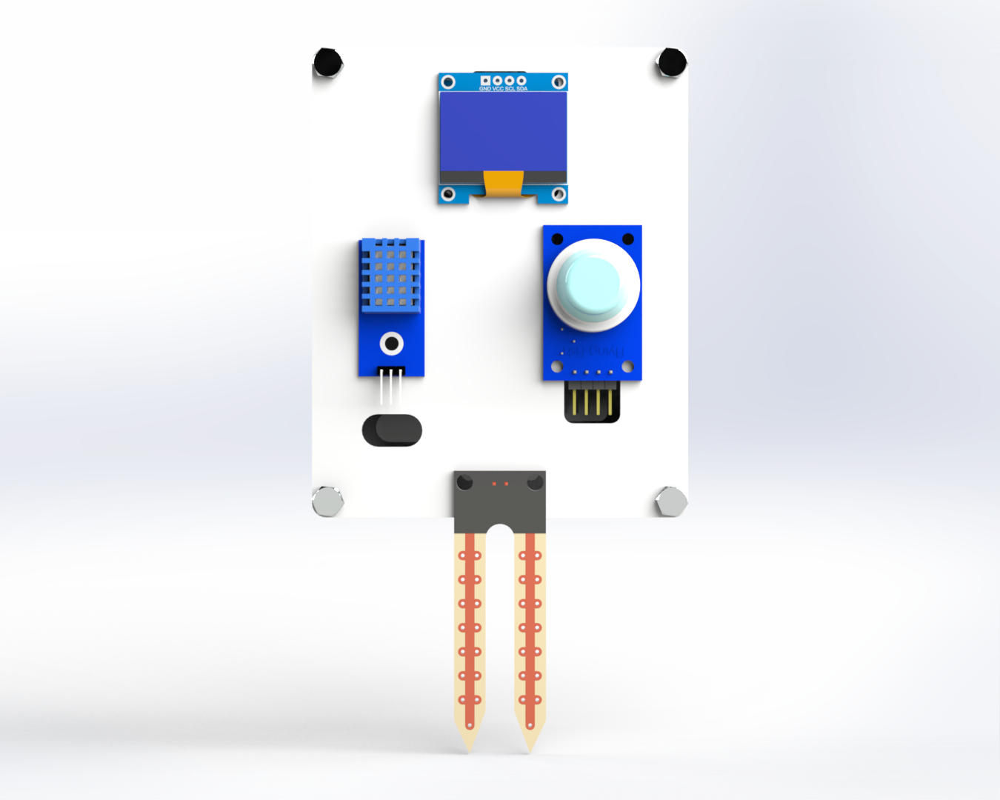

The Air and Aqua Analyzer is an environmental monitoring system that measures air quality, temperature, humidity,
and soil moisture in real-time. It uses multiple sensors to collect environmental data and displays it on an OLED
screen. This kit helps in understanding IoT-based monitoring and multi-sensor data integration.

  
   
  <em>Figure 1: Air_And_Aqua_Ciruit_Diagram</em>

 

  
   
  <em>Figure 2: Air_And_Aqua</em>

