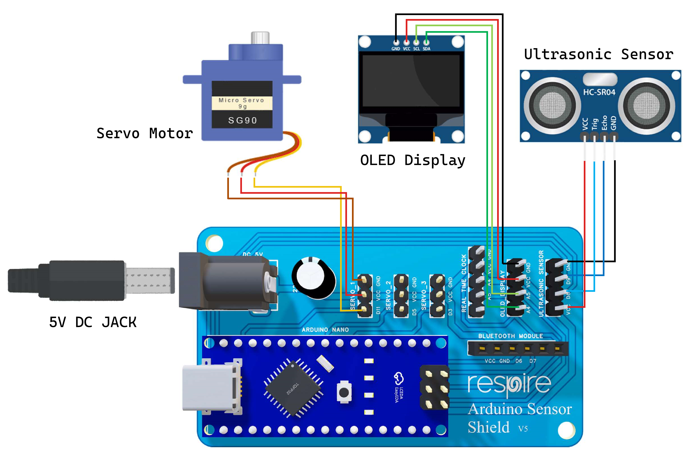
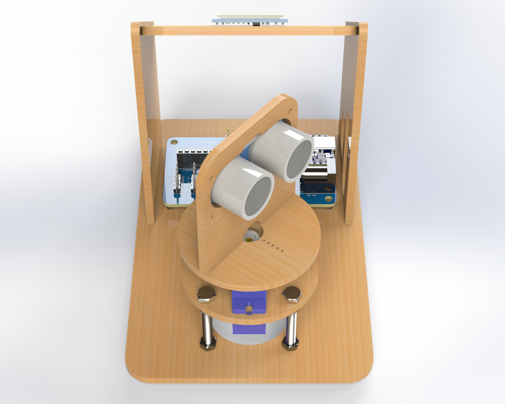

A Flight Radar system is a basic object detection setup that uses an ultrasonic sensor mounted on a servo motor to
scan the surroundings over a 180° range. In this project, we are not using real radar waves but ultrasonic waves (sound
waves). Even though it is simpler, it still shows how a radar works by scanning an area, finding objects, and showing
their position using angle and distance.

  
   
  <em>Figure 1: Flight Radar Circuit Diagram</em>

 

  
   
  <em>Figure 2: Flight Radar</em>

