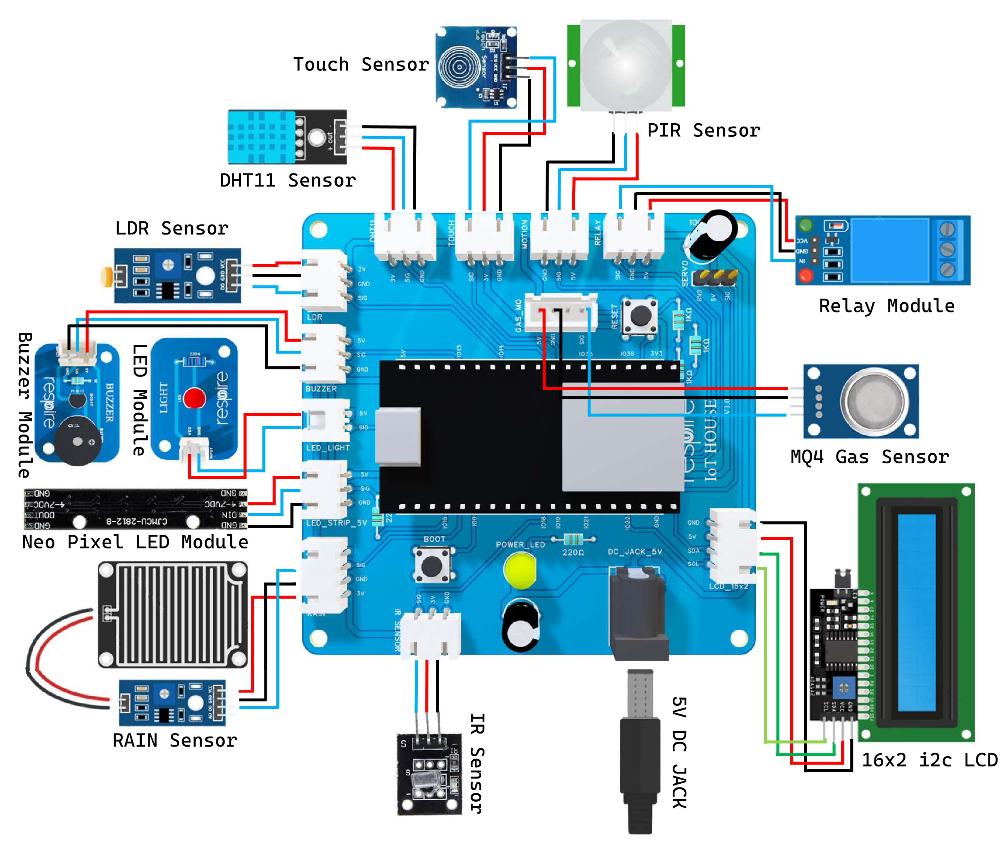

This IoT House Kit is designed to help learners explore real-world Internet of Things concepts through hands-on
experimentation. It integrates multiple sensors, actuators, and wireless control using ESP32, enabling automation,
monitoring, and smart decision-making. The kit supports 10+ activities ranging from basic sensor interfacing to
advanced home automation using a web-based dashboard.

*Figure 1: IoT_House_Ciruit_Diagram*
 
 

*Figure 2: IoT_House*

